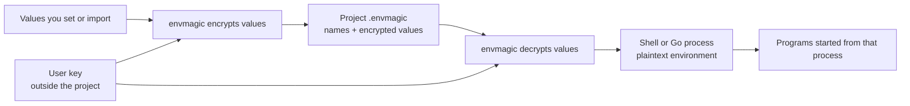

# envmagic

Encrypted environment variables beside your code; a separate key in your user config directory.

`envmagic` stores values in a project's `.envmagic` SQLite file and loads them into
an existing shell or Go process when needed. Values use AES-256-GCM encryption;
variable names and namespaces remain readable. No service or account is required.



## Is it a fit?

Use it for local project configuration and secrets you would otherwise keep in
plaintext dotenv files. Namespaces separate configurations such as `default`
and `staging`; directory lookup lets commands in subdirectories use the project store.

It is **not** a password manager or a multi-user secrets service. One user key
serves all projects on that machine. Namespaces are not access controls, and
loaded values are plaintext in memory. Someone who can read both your store and
key can decrypt your values. See [how it works and what it protects](docs/how-it-works.md).

## Install

Download a prebuilt archive for Linux, macOS, or Windows from
[GitHub releases](https://github.com/peteraba/envmagic/releases), extract it, and
put `envmagic` on your `PATH`.

Or install with Go 1.26.0 or newer:

```sh
go install github.com/peteraba/envmagic/cmd/envmagic@latest
```

From a clone, `make build` creates `./envmagic`; put it on your `PATH` to use the
shell integration.

## Try it in Bash

Run this in a fresh project directory. The value below is only a demo;
[use stdin for real secrets](docs/usage.md#store-and-read-values). If you are
reusing an existing store, [restore its original key](docs/operations.md#back-up-and-restore)
before writing; a newly generated key cannot decrypt its old values.

```sh
# Enable integration in this shell; add this line to ~/.bashrc for future shells.
eval "$(envmagic shell-init bash)"

# Use this directory, not an existing store in a parent directory.
envmagic --here --yes set demo_token 'not-a-real-secret'
envmagic list
envmagic load demo_token
printf '%s\n' "$DEMO_TOKEN"
```

`set` uppercases the name to `DEMO_TOKEN`. With the integration installed,
`load` updates the current shell. Without it, the binary only prints assignments.
[Zsh, fish, PowerShell, and scripts](docs/usage.md#shell-setup) have their own setup.

**Back up your key after the first write.** `envmagic key` prints its path and
base64 content; save the content in a password manager or another trusted backup.
Losing the key makes existing values unrecoverable. Do not replace an existing
key to fix a decryption error: it is shared across projects.
[Backup and recovery](docs/operations.md#back-up-and-restore).

## Go deeper

| Your question | Guide |
| --- | --- |
| How do I set, load, import, or export values? | [Usage](docs/usage.md) — shell setup, commands, namespaces, scripts, and dotenv rules |
| Which store gets used, and what changes in my shell? | [Store selection](docs/usage.md#which-store-is-used) and [the load boundary](docs/usage.md#what-load-changes) |
| How do encryption and storage work? What can an attacker see? | [How it works](docs/how-it-works.md) — architecture, data flow, and security boundaries |
| How do I back up, share, use CI, or fix an error? | [Operations](docs/operations.md) — recovery, Git, teams, worktrees, and troubleshooting |
| How do I use it from Go? | [Go library](docs/go-library.md) — explicit paths, reads, process loading, and errors |
| How do I report a vulnerability? | [Security policy](SECURITY.md) |

## Upgrading from older builds

Older ciphertext may need re-importing with the old binary **before** you write
new-format values. Follow the [upgrade procedure](docs/operations.md#upgrading-from-older-builds)
for every store and namespace; ordinary key restoration does not migrate ciphertext.

## License

MIT. See [LICENSE](LICENSE).
