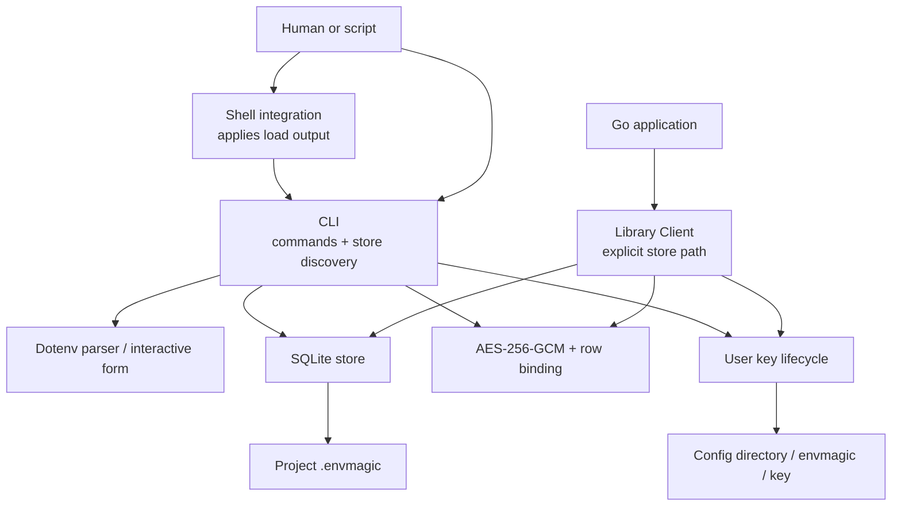
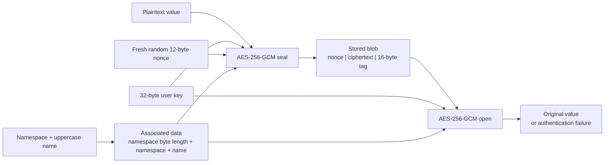
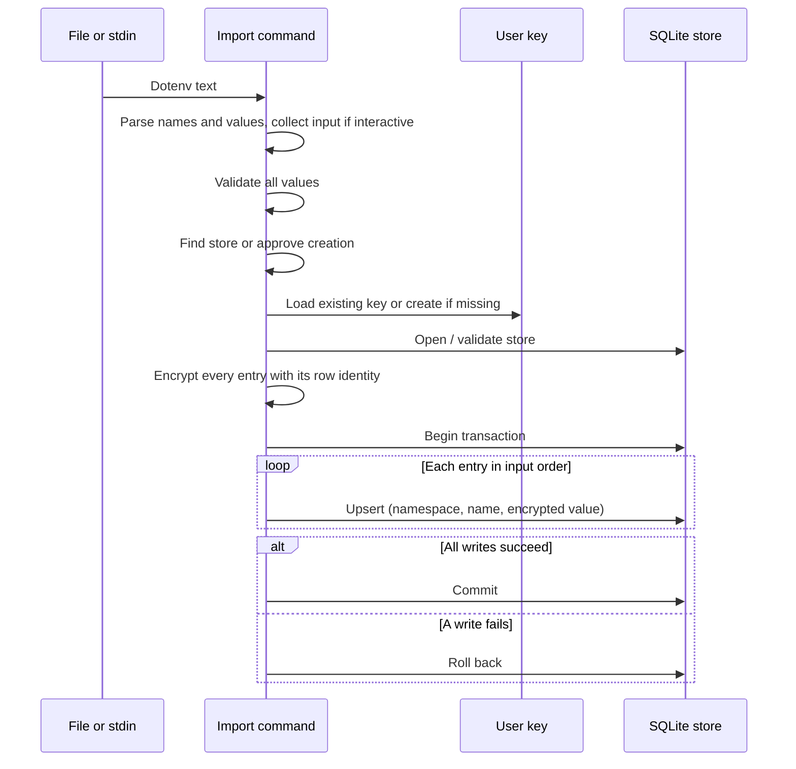

# How it works

[Overview](../README.md) · [Usage](usage.md) · [Operations](operations.md) · [Go library](go-library.md)

## The mental model

There are two persistent files and one runtime destination:

| Item | Scope | Contents |
| --- | --- | --- |
| `.envmagic` | Project | SQLite rows: plaintext namespace/name and encrypted value |
| User config's `envmagic/key` | OS user; shared across projects | One raw 32-byte encryption key |
| Environment | Current shell or Go process | Decrypted values, inherited by subsequently started children |

An entry is identified by **(namespace, name)**. The same name can have different
values in different namespaces. Selecting a namespace filters rows; it does not
select a different key or grant different permissions.

The CLI walks parent directories to find a store. The library uses the path you
supply, or exactly the current directory's `.envmagic` with `Open()`; it does not
walk parents. Neither loading route modifies other already-running processes.

## Components

| Responsibility | Source |
| --- | --- |
| Commands, discovery, load formatting | [`cmd/envmagic/main.go`](../cmd/envmagic/main.go) |
| Applying output in the parent shell | [`cmd/envmagic/shellinit.go`](../cmd/envmagic/shellinit.go) |
| Dotenv parsing and batched writes | [`cmd/envmagic/envfile.go`](../cmd/envmagic/envfile.go) |
| Interactive input and masking | [`cmd/envmagic/form.go`](../cmd/envmagic/form.go) |
| Public read/load API | [`client.go`](../client.go) |
| SQLite schema and transactions | [`internal/store.go`](../internal/store.go) |
| Key location, creation, and restoration | [`internal/key.go`](../internal/key.go) |
| Authenticated encryption and row binding | [`internal/crypto.go`](../internal/crypto.go) |
| Variable name validation | [`internal/name.go`](../internal/name.go) |

## What is encrypted?

The database is not encrypted as a whole. Each row in `env_vars` has:

- `namespace` and `name`: plaintext text; together they form the primary key.
- `value`: an encrypted blob.
- `updated_at`: a plaintext timestamp, updated on writes.

Names, namespaces, timestamps, row counts, and encrypted-value lengths are
visible to someone who can read the file. `list` uses names without decrypting;
`rm` deletes a row without needing the key.

The associated data is encoded as
`uvarint(byte length of namespace) || namespace || name`. The length prefix
prevents ambiguous concatenations. Associated data is authenticated, not hidden;
it must be reconstructed from the same namespace and name when decrypting.

Changing the ciphertext, or copying it to a row with a different namespace/name,
causes authentication failure. Renaming a variable requires decrypting and
storing it under the new name; editing the SQLite name is not a rename operation.
This binding does **not** prevent deleting rows, replaying an older value under
the same identity, or replacing the store with an older copy.

## Writes and failure boundaries

`set` and `import` share the encryption/write path. Import parses its entire
input first; interactive input or empty-template handling happens before writes.

The transaction makes the **entry updates** all-or-nothing; it does not include
key creation or store-file creation. A failure can leave a new key or an empty
store. Import is an upsert, not namespace replacement: omitted names stay, and
the last occurrence of a duplicate name wins.

The store uses SQLite with a five-second busy timeout. It attempts to use DELETE
journaling, but that switch is best-effort: an existing WAL-mode store can stay
in WAL mode while another connection is open. Close active users before treating
the main file alone as a complete backup.

## Reads and the environment boundary

`get` decrypts one value and prints it. `load` decrypts and validates the requested
values, then emits shell assignments. Full-namespace output is built before
anything is printed, so a decryption or validation failure does not emit a
partial batch. Values containing NUL cannot be stored or loaded by the CLI;
PowerShell load output also rejects invalid UTF-8.

The shell wrapper checks the binary's status before applying output. Bash/Zsh
and fish evaluate quoted assignments; PowerShell validates the assignment syntax,
decodes base64, and sets environment entries directly. Base64 is a transport
encoding, **not encryption**. The [load sequence](usage.md#what-load-changes)
shows why the wrapper is necessary.

The Go library decrypts the whole namespace and checks names and NUL bytes before
calling `os.Setenv`. In both routes, preflight protects against partial updates
caused by bad stored values. Environment application itself is not a rollback
transaction: a shell assignment or `os.Setenv` error can occur after earlier
assignments. Existing variables with matching names are overwritten; other
variables are not cleared.

## Security boundaries

| Situation | What envmagic does / does not do |
| --- | --- |
| Someone gets only the store | Values are encrypted; metadata remains visible |
| Someone gets store and key | They can decrypt every project/namespace using that key |
| Someone modifies a value or swaps it between different rows | GCM authentication fails on decrypt |
| Someone deletes data or restores an older store | No availability guarantee or rollback detection |
| Code already runs as your user | Not defended: it can read your key, store, and runtime values |
| Secrets are loaded, read, exported, or debugged | Plaintext reaches memory, environments, stdout, or stderr |
| A value is entered as a command argument | Shell history and process listings may expose it; prefer stdin |
| Teammates need different namespace permissions | Not supported; namespaces are organizational, not access controls |

On Unix, new stores and keys use mode `0600`; the key directory is created with
`0700`. The CLI warns if key permissions allow group/other access. The CLI skips
foreign-owned stores (including when run as root); the library refuses to open
them. Symlinks to your own stores are accepted. These are checks, not a sandbox:
path-based checks do not provide a guarantee against adversarial file swaps.
Stores containing triggers, views, or other non-table/index schema objects are
rejected, and names read in a batch are validated before use.

Windows has no Unix-style ownership check. Go's `0600` mode does not establish
Windows access control; the default key location relies on your private
`%AppData%` ACL. Protect store files and backups with appropriate Windows ACLs.

There is no hosted vault, per-project key selection in the CLI, built-in access
policy, audit trail, or automatic key rotation. Use a different secrets system
if those are requirements. For key handling, Git history, and sharing, read
[Operations](operations.md). Report vulnerabilities through the
[security policy](../SECURITY.md), not a public issue.
