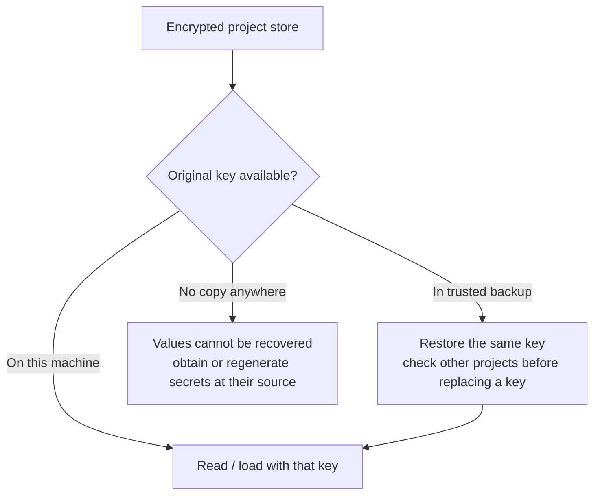

# Operations

[Overview](../README.md) · [Usage](usage.md) · [How it works](how-it-works.md) · [Go library](go-library.md)

## Back up and restore

Back up **both** the encrypted store and its key. The store alone is not enough
to recover values; the key alone does not contain them. Keep the key in a password
manager or another backup you would trust with the plaintext secrets. Storing
both together gives anyone with that backup the ability to decrypt the values.



The default key location comes from the OS user config directory:

| OS | Path |
| --- | --- |
| Linux | `$XDG_CONFIG_HOME/envmagic/key`, usually `~/.config/envmagic/key` |
| macOS | `~/Library/Application Support/envmagic/key` |
| Windows | `%AppData%\envmagic\key` |

`envmagic key` prints the exact path and the key's base64 content. Copy the content
into your secure backup, not a repository, issue, terminal transcript, or CI log.
The key is generated by the first `set` or `import` that needs it. At creation,
the key itself is printed to stderr only when stderr is a terminal; otherwise
only the path and a hint to run `envmagic key` are printed.

To restore, supply the saved base64 content (here already held in `$SAVED_KEY`):

```sh
envmagic key --set "$SAVED_KEY"
```

The decoded content must be exactly 32 bytes; invalid input is rejected before
writing. **Valid input replaces the existing key.** Restoration does not
re-encrypt any store, and this key may serve many projects. Check whether a key
already exists and back it up before replacing it. The expanded restore argument
can be visible in process listings; do this only in a trusted environment with
shell tracing disabled.

If an existing store's key is missing, restore the original key **before writing**.
`set` and `import` can generate a new key when one is missing; that new key cannot
decrypt the old rows and can leave a store containing values encrypted by different
keys. There is no built-in key-rotation or recovery command.

For a file-level store backup, stop processes using it first. SQLite journaling
may leave companion files while a store is active; copying only `.envmagic` then
is not a reliable snapshot. See [storage boundaries](how-it-works.md#writes-and-failure-boundaries).

## Git, teams, and worktrees

### Should the store be committed?

The values are encrypted, so committing `.envmagic` is possible if you accept
exposing its names, namespaces, timestamps, sizes, and history. Alternatively,
ignore it and back it up outside Git. **Never commit the key.** Old commits retain
old ciphertext; someone who later obtains the matching key can read it. Deleting
a row does not revoke the underlying credential or erase earlier copies.

`.envmagic` is binary SQLite, not a mergeable text file. If both branches changed
it, choose one store as the base, then re-apply the other branch's intended changes
with `set`, `rm`, or a reviewed import. Preserve both versions until finished;
ensure all required values are available before discarding either. Do not edit
SQLite rows or attempt a text merge. Imported names overwrite matches but do not
remove entries absent from the input.

### Sharing with a teammate

A shared encrypted store needs the **same encryption key** on each machine.
Transfer the key through a trusted channel, separately from the store. Everyone
with both can decrypt all its namespaces. `envmagic` has no per-user permissions
inside the store or automatic revocation.

Because the default key is per-user, importing a teammate's key can break access
to your other projects. Agree on key handling before adopting a shared store; do
not overwrite an established personal key just to open one project. If independent
access control, revocation, or team auditability is required, use a secrets system
that supplies it. Rotating credentials at their source is distinct from replacing
the encryption key.

### Worktrees outside the main checkout

Parent lookup cannot find a store in a separate directory tree. On systems with
symlinks, point the worktree at the main checkout's store:

```sh
# Run in the worktree; replace this path with the main checkout's absolute path.
ln -s /absolute/path/to/main-checkout/.envmagic .envmagic
```

Do not copy the store to synchronize worktrees: the copies diverge. A symlink
means writes from either checkout affect the same store. On Unix, its target must
be owned by your user. A shared store may still need the correct namespace for
each task; switching branches does not select one automatically.

## Scripts and CI

Noninteractive creation requires `--yes` or `ENVMAGIC_NONINTERACTIVE=1`.
`--here --yes` on `set` or `import` limits creation/writes to the current directory
instead of unexpectedly using a parent store. Reads still use normal discovery.

For an existing encrypted store, provision the original key from your CI's
protected secret mechanism. Use a dedicated runner/config directory and restore
with `envmagic key --set "$SAVED_KEY"`; do not expose its argument with tracing.
Avoid `key`, `get`, `export`, or `--debug load` in logs. CI's secret masking is not
a substitute for avoiding plaintext output.

Load and execute in the same shell step, checking success:

```sh
# Example for a Go project; envmagic must be on PATH and the key provisioned.
assignments=$(command envmagic load) && eval "$assignments" && go test ./...
```

A later job step or unrelated shell does not inherit those assignments. The key
and loaded values are accessible to code running as the runner's user; do not run
untrusted jobs with production secrets.

## Troubleshooting

| Symptom | Action |
| --- | --- |
| `no .envmagic file found ... or any parent` | Check the working directory; for a separate worktree, link the intended store |
| New store fails without a terminal | Add `--here --yes` to the intended `set`/`import`; don't do this to repair a missing key |
| `no key at PATH` with an existing store | Restore that store's original key; do not generate a replacement |
| Decryption fails / `stored by an older envmagic` | Check the key; if the format is old, follow the upgrade procedure below |
| `get` prints a value but `$NAME` is unchanged | Use `load NAME` with shell integration, in the shell that starts the program |
| `command not found` after `get` or bare `envmagic` | Refresh an old shell function; see [shell setup](usage.md#shell-setup) |
| `NAME not found in namespace ...` | Check `list` in the intended namespace and verify the selected store |
| `flag provided but not defined: -...` | Use `set -- NAME VALUE`; PowerShell requires a quoted `'--'` |
| `open -: no such file or directory` | Omit `-`; stdin is the default for import |
| `unterminated double-quoted value` | Replace literal multiline dotenv content with escaped `\n`, or set that value directly |
| `invalid variable name ... in store` / schema contains triggers or views | Stop; the store was modified outside the supported format. Restore a trusted backup rather than patching SQLite |
| Store owned by another user is skipped/refused | Use a store owned by your user; do not bypass the check by running as root |
| Variable from a previous namespace remains set | Loading does not clear absent names; use a fresh shell or explicitly unset them |

## Upgrading from older builds

Older builds encrypted values without the current namespace/name binding. Those
rows need re-importing; the new build does not silently accept the older format.

1. **Before upgrading, preserve the old binary as `envmagic-old`.** Keep your
   original key and back up the encrypted stores. Do not write new-format values
   into a namespace before its old values have been exported.
2. Identify every store and namespace, including `default`. If needed, a
   read-only query lists namespaces:
   `sqlite3 .envmagic 'SELECT DISTINCT namespace FROM env_vars'`.
3. From each store's directory, run the pipeline below for **each namespace**.
   Replace `NS` with its name. Use Bash or Zsh and enable `pipefail` so an old
   export failure cannot be hidden by a successful import. For a legacy namespace
   named `load`, use the separate example below instead.

```sh
set -o pipefail
envmagic-old -n NS export | envmagic -n NS import
```

Check the exit status and stderr for every pipeline. The old export cannot read
new-format rows; without `pipefail`, a failing export can appear successful.

Two limits need manual handling:

- The old exporter silently replaces non-UTF-8 bytes with U+FFFD. Re-set such
  values from their original source using the new build; the pipeline cannot
  preserve their bytes.
- The current importer has a 16 MiB per-line buffer limit. If an exported line
  reaches that limit, it imports none of the input. Exclude those names, import
  the remainder, then re-set the large values directly. For one known name,
  filter **before** it reaches the importer:
  `envmagic-old -n NS export | grep -v '^NAME=' | envmagic -n NS import`.

If you already wrote a name with the new build, preserve the value you intend to
keep, remove only that new-format row with `envmagic -n NS rm NAME`, re-import the
old rows, then set the preserved value again. Otherwise the old export fails on
that row. Never delete the original key to work around this.

An old CLI namespace named `load` is no longer selectable. Export it with the
old build into a supported, unused destination namespace (here `legacy-load`),
keeping the original store as a backup:

```sh
set -o pipefail
envmagic-old -n load export | envmagic -n legacy-load import
```

Once every store and namespace has migrated successfully and the intended values
load, remove `envmagic-old`.
