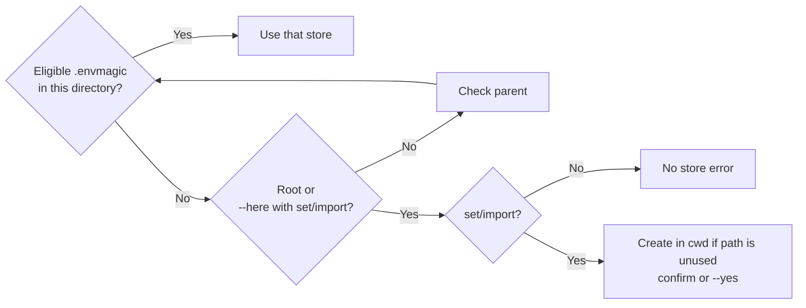
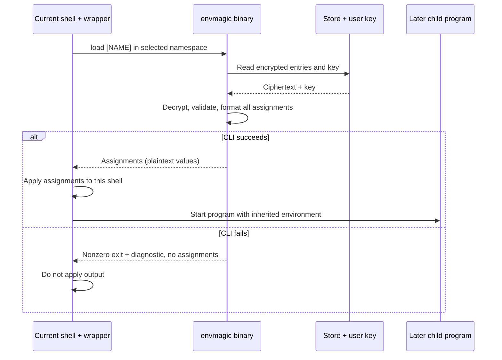

# Usage

[Overview](../README.md) · [How it works](how-it-works.md) · [Operations](operations.md) · [Go library](go-library.md)

## Shell setup

The binary cannot change its parent shell's environment. The integration defines
an `envmagic` function that applies successful `load` output; other commands go
straight to the binary.

Add the appropriate line to your shell's startup file, then open a new shell or
run it once in the current one:

| Shell | Startup file | Line |
| --- | --- | --- |
| Bash | `~/.bashrc` | `eval "$(envmagic shell-init bash)"` |
| Zsh | `~/.zshrc` | `eval "$(envmagic shell-init zsh)"` |
| fish | `~/.config/fish/config.fish` | `envmagic shell-init fish \| source` |
| PowerShell | `$PROFILE` | `envmagic shell-init pwsh \| Out-String \| Invoke-Expression` |

After upgrading, refresh the function or restart the shell: an old wrapper stays
in an already-open session. In Bash or Zsh, refresh it with
`eval "$(command envmagic shell-init bash)"` (use `zsh` for Zsh).

For POSIX scripts without the integration, check the binary's exit status before
applying its output:

```sh
assignments=$(command envmagic load) && eval "$assignments"
```

Keep loading and the program that needs the variables in the same shell process.
In automation, chain the program with `&&` so it does not run after a failed load.

## Store and read values

```sh
# Demo values only; these arguments can appear in history and process listings.
envmagic set api_key 'demo-value'
envmagic get API_KEY
envmagic load API_KEY
envmagic list
envmagic rm API_KEY
```

Names are uppercased and must match `[A-Z_][A-Z0-9_]*` after conversion. Prefer
explicit `set` and `get`: shorthand `envmagic NAME [VALUE]` is ambiguous when the
name matches a subcommand, such as `list` or `key`. Bare `envmagic` shows help.
`get` prints the raw value followed by a newline; it does not load anything.

For a real secret already supplied securely in `$SECRET`, use stdin to avoid
putting its value in command arguments:

```sh
printf '%s' "$SECRET" | envmagic set API_KEY
```

This avoids adding the value to the command line, not all plaintext exposure.
Do not type a literal secret into a command that assigns `$SECRET`, or enable
shell tracing around secrets. Stdin accepts up to 1 MiB and removes **one** final
LF or CRLF. It rejects empty input; use `envmagic set NAME ''` for an empty value.
For a new store with piped input, use `envmagic --here --yes set API_KEY`.

Use `--` before positional arguments when a value starts with `-`:

```sh
envmagic set -- PREFIX -example
# Preserve an existing multiline value without the stdin newline trimming:
envmagic set -- CERTIFICATE "$CERTIFICATE"
```

In PowerShell, quote the separator: `envmagic set '--' PREFIX -example`.
Multiline values can be stored and loaded; literal multiline quoted values are
not supported by the dotenv importer described below.

## Which store is used?

All CLI store commands search from the working directory toward the filesystem
root and use the nearest eligible `.envmagic`. This applies to writes too: a
`set` inside a subdirectory normally changes the parent project's store.



On Unix, stores owned by a different user are skipped with a warning, even when
running as root. Symlinks to stores you own work. Windows has no ownership check.
If the local path exists but was skipped, envmagic refuses to overwrite it.

`set` and `import` report `envmagic: using PATH` on stderr when writing to a
parent store. `--here` restricts **these two commands only** to the working
directory; it does not redirect reads. If no store is found, writes ask before
creating one. Without a terminal, supply `--yes` or `ENVMAGIC_NONINTERACTIVE=1`.
These allow creation; they do not force a fresh store when a parent store exists.

## Namespaces

A namespace is a separate set of names inside the same store, selected with
`-n NS` or `--namespace NS`. The default is `default`; namespaces are used as
written, not uppercased. Give the namespace flag only once. The CLI reserves
`load` as a namespace name, including for older stores that already used it.

```sh
envmagic -n staging set API_URL 'https://staging.example.test'
envmagic -n staging load
envmagic -n staging list
```

Loading overrides matching environment variables, but **does not unset** names
absent from the chosen namespace. Switching namespaces is not a clean environment
reset. Start a fresh shell or explicitly unset unwanted names when that matters.
Namespaces do not isolate users who have the key.

## What load changes



Already-running programs and unrelated terminals do not receive the changes.
`load NAME` loads one variable; `load` loads the whole namespace. The CLI decrypts
and validates the full requested batch before emitting it. Applying assignments
can still fail in the shell (for example, a readonly variable); this is not a
rollback transaction across the environment.

The wrappers accept only `-n`/`--namespace` and an optional valid name for `load`.
Help, version, and explicit `--format` requests pass through without applying
assignments. Namespace names literally matching those flags (such as `--help`
or `--format`) also trigger pass-through; prefer ordinary namespace names.
For Bash/Zsh scripts, bypass the wrapper with `command envmagic`. For PowerShell,
resolve the application with
`$binary = (Get-Command envmagic -CommandType Application).Source`, then invoke it
with `& $binary ...`.

| Binary output | Request | Applying it without the wrapper |
| --- | --- | --- |
| POSIX `export` statements | `envmagic load` | Success-checked `eval`, as above |
| fish `set -gx` statements | `envmagic --format fish load` | Capture output, check the binary status, then evaluate it in fish |
| PowerShell UTF-8/base64 assignments | `envmagic --format pwsh load` | Prefer the wrapper, which validates assignments before setting variables |

Bash/Zsh and fish wrappers evaluate shell-quoted values; the PowerShell wrapper
parses the expected assignment format and sets environment entries without
evaluating the values as code. PowerShell output requires valid UTF-8. Empty
values remain set in PowerShell 7.6.6 on Linux; versions that remove variables on
empty assignment will unset them instead. Windows behavior has not been verified.
All load formats reject NUL bytes.

`command envmagic --debug load` prints assignments to stdout **and stderr**.
This reveals values; keep it out of CI logs and bug reports.

## Import and export

```sh
envmagic import existing.env
printf 'API_URL="https://example.test"\n' | envmagic --yes import
envmagic import -i template.env
envmagic import --empty template.env
envmagic export
```

Omit the import file to read stdin; `import -` tries to open a file named `-`.
`-i` / `--interactive` requires a file and a terminal. Enter keeps the template
value; fields with `KEY`, `SECRET`, `TOKEN`, or `PASS` in the name are masked.
`--empty` stores empty values instead of template defaults and cannot be combined
with `--interactive`.

Import overwrites matching names in the selected namespace and leaves other
names intact. Repeated names, including names that uppercase to the same name,
use the last value. Parsing, value checks, and encryption precede a single write
transaction; a parse failure writes no values.

The dotenv format is deliberately small; it does not execute shell code:

- One `NAME=value` per line; blank lines, leading-whitespace comments, an initial
  UTF-8 BOM, and an optional `export ` prefix are accepted.
- Values can be unquoted, single-quoted, or double-quoted. No variable or command
  expansion occurs. Single-quoted content is literal.
- Double quotes support `\n`, `\r`, `\t`, `\\`, `\"`, `\$`, and an escaped backtick.
  Unknown escapes keep the backslash. Use `\n` for embedded newlines, not literal
  newlines between quotes.
- After a quoted value, only whitespace or a `#` comment is allowed. In an
  unquoted value, `#` is literal; leading spaces after `=` stay, trailing spaces
  and tabs are trimmed.
- The scanner's per-line buffer limit is 16 MiB. Imports are not streaming
  writes: the batch is parsed and encrypted in memory before commit.

**Export is plaintext**, not a backup of the encrypted store. `export` prints to
stdout; `export FILE` writes/overwrites a file, using mode `0600` on Unix regular
files, and refuses to overwrite the active store or key (including aliases to
those files). A failed file write can leave a truncated file. Prefer pipes to
trusted consumers; keep exported files, terminal output, and logs private.

## Command reference

Global flags go before the command. Run `envmagic --help` or `envmagic COMMAND --help`
for full syntax.

| Command | Purpose |
| --- | --- |
| `set NAME [VALUE]` | Encrypt and upsert; omitted value reads piped stdin |
| `get NAME` | Print one decrypted value and a newline |
| `load [NAME]` | Emit assignments; integration applies them |
| `list` / `ls` | List names, not values; no key required |
| `rm NAME` | Delete an entry; no key required; does not unset the shell variable |
| `import [FILE]` | Read dotenv from file or stdin; optional `-i` or `--empty` |
| `export [FILE]` | Decrypt namespace to plaintext dotenv, stdout by default |
| `key` / `key --set BASE64` | Show or restore the user key; [read the recovery warning](operations.md#back-up-and-restore) |
| `shell-init SHELL` | Print integration for `bash`, `zsh`, `fish`, or `pwsh` |
| `help` / `--version` | Show help or version |

Global flags: `-n`/`--namespace NS`, `--here`, `-y`/`--yes`,
`--format posix|fish|pwsh`, and `-d`/`--debug`. Read the constraints above before
using them with the shell wrapper.
